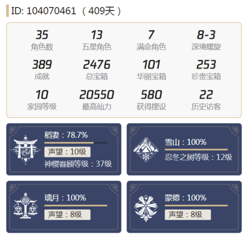
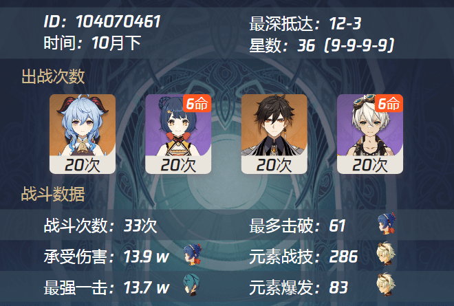
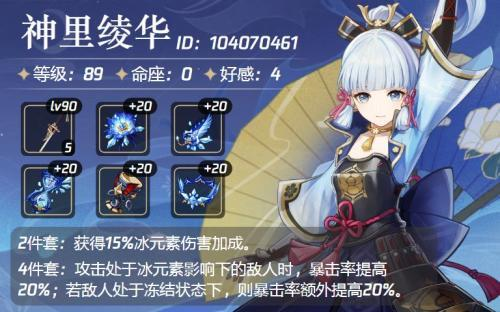
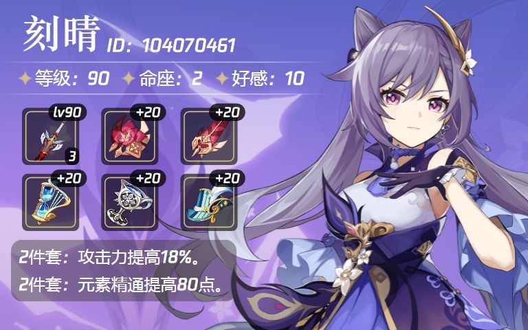
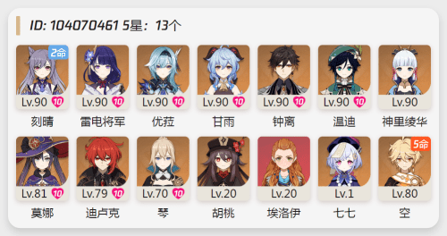
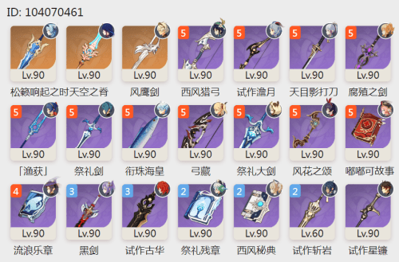
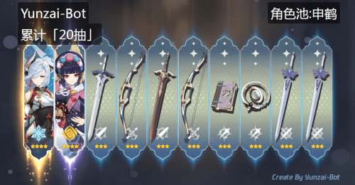

# Yunzai-Bot
原神Q群机器人，通过米游社接口，查询原神游戏信息，生成图片返回

# 使用方法
>环境准备： Window环境，Nodejs，Redis

```
1.安装
git clone https://github.com/Le-niao/Yunzai-Bot.git
cd Yunzai-Bot
npm install

2.配置
打开config文件夹，复制一份 config_default.js 重命名为 config.js
打开config.js填写好配置

3.运行
node app
```

# 操作指令
### #角色


### #深渊/#上期深渊


### #神里/#老婆/#老公



### #四星/#五星


### #武器


### #十连


## 致谢
| Nickname                                                     | Contribution                        |
| :----------------------------------------------------------: | ----------------------------------- |
|[SilveryStar](https://github.com/SilveryStar/Adachi-BOT) | 提供了抽卡图片资源 |
|[lulu666lulu](https://github.com/lulu666lulu) | 提供了最新的DS算法 |


