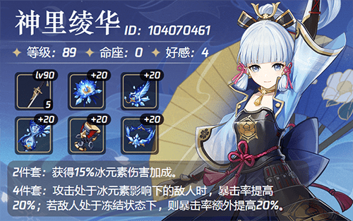
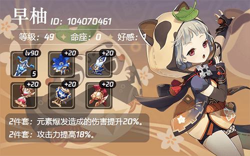
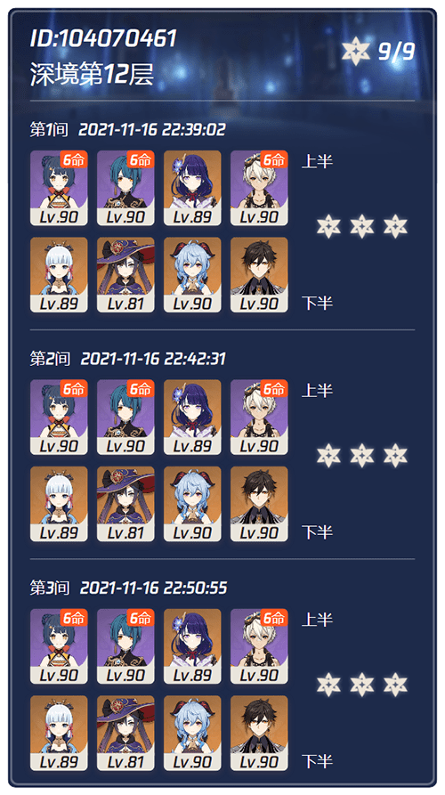
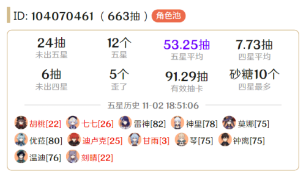

# Yunzai-Bot
云仔，原神qq群机器人，通过米游社接口，查询原神游戏信息，生成图片返回

# 使用方法
>环境准备： Windows or Linux，Nodejs，Redis

```
1.安装
git clone https://github.com/Le-niao/Yunzai-Bot.git
cd Yunzai-Bot
npm install

2.配置
打开config文件夹，复制一份 config_default.js 重命名为 config.js
打开config.js填写好配置

3.运行
node app
```

# 操作指令
>群昵称加上游戏的uid（仅第一次需要），#号+指令触发
>
>下面详细指令展示，[其他说明](resources/readme/命令说明.md)，[抽卡记录帮助](resources/logHelp/记录帮助.md)

### #角色名称/#神里/#老婆/#老公



<details>
<summary>#角色</summary>

</details>

<details>
<summary>#深渊、#深渊12层</summary>


</details>

<details>
<summary>#四星/#五星</summary>

</details>

<details>
<summary>#武器</summary>

</details>

<details>
<summary>#角色记录/#常驻记录/#武器记录</summary>

</details>

<details>
<summary>#十连、#十连2</summary>

</details>

<details>
<summary>添加表情</summary>

</details>

## 致谢
| Nickname                                                     | Contribution                        |
| :----------------------------------------------------------: | ----------------------------------- |
|[SilveryStar](https://github.com/SilveryStar/Adachi-BOT) | 使用了其抽卡图片资源 |
|[lulu666lulu](https://github.com/lulu666lulu) | 提供了最新的DS算法 |


